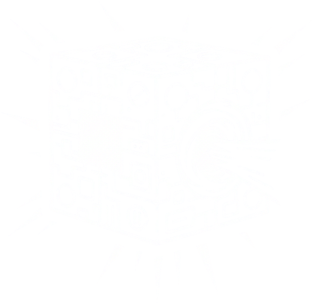

# Semantic World

Introducing Semantic World: A unified interface for scene data and asserted meaning.

The Semantic World Python package streamlines the integration and management of scene graphs with explicit semantic assertions.
Agents and autonomous systems require more than just coordinates, they need contextual understanding. 
Semantic World bridges geometry, kinematics, and meaning, allowing systems for planning, 
learning, and reasoning to process the environment through actionable, high-level concepts.

This enables the construction of environments that can be readily understood,
queried, transformed, and shared across projects.
Whether for research prototypes or robust data pipelines,
Semantic World translates raw environment data into structured knowledge.

## Assimilated Technologies

```{raw} html
<div style="display: flex; flex-direction: row; align-items: center; gap: 30px;">
  <div style="flex: 1; max-width: 70%;">
    
    
  </div>
  <div style="flex: 2; display: flex; flex-direction: column; gap: 1em;">
    <p>🌍 <b>Model full kinematic worlds, not just meshes</b>. Define bodies, regions, connections, and degrees of freedom as primary, first-class entities within a clean, composable Python API.</p>
    <p>🤔 <b>Enhance meaning with Views.</b> Transform raw geometry into actionable concepts like drawers, handles, containers, and task-relevant regions. Express relationships and intent beyond simple shapes.</p>
    <p>💡 <b>Intelligent Querying.</b> Use a high-level entity query language to precisely locate relevant elements—e.g., "the handle attached to the drawer that is currently accessible"—to enable targeted interaction.</p>
  </div>
</div>
```

🛢️️ **Reproducible Persistence and Replay.** 
Serialize annotated worlds into a SQL format, allowing for faithful reconstruction as consistent, interactive objects. 
This facilitates reproducible experiments and robust machine learning data pipelines.

🛠️ **Effortless Composition.** 
Leverage factories and dataclasses for simple authoring of complex scenes and extending semantics. 
Share domain knowledge efficiently without reliance on fragile glue code.

📈 **Scale and Consistency.** 
The integrated kinematic tree, DoF registry, 
and robust world validation ensure model consistency and integrity from initial prototype to large-scale production deployment.

🔮 **Flexible Visualization.** 
View worlds in lightweight RViz2, explore within notebooks, or integrate with richer simulation environments. 
Quickly understand both the structural and semantic layers of your models.

🔌 **Pluggable Integration.** 
Use a multitude of adapters for seamless import, no matter if its URDF, USD, MJCF, etc. 

🦾 **Reliable Kinematics.** 
Compute forward transforms and inverse (backward) kinematics cleanly across the tree, 
providing a straightforward and robust foundation for pose queries, control, and reasoning.

👯‍ **Real-Time World Synchronization.** 
Maintain a consistent state across multiple processes and robotic agents using lightweight, 
real-time world synchronization. 
Structures can be created, merged, and updated at once, 
ensuring they are accurately reflected across all connected instances.

🚀 Get started with the [](user-guide)!

🤝 Contribute with the [](developer-guide)!

## Acknowledgements
This package originates from different developments of the [AICOR Institute for Artificial Intelligence](https://ai.uni-bremen.de/). 
Four different projects developed a very similar component for different parts of cognitive modules.
This project aims to unify it under one solution that is flexible enough for all the different applications.

